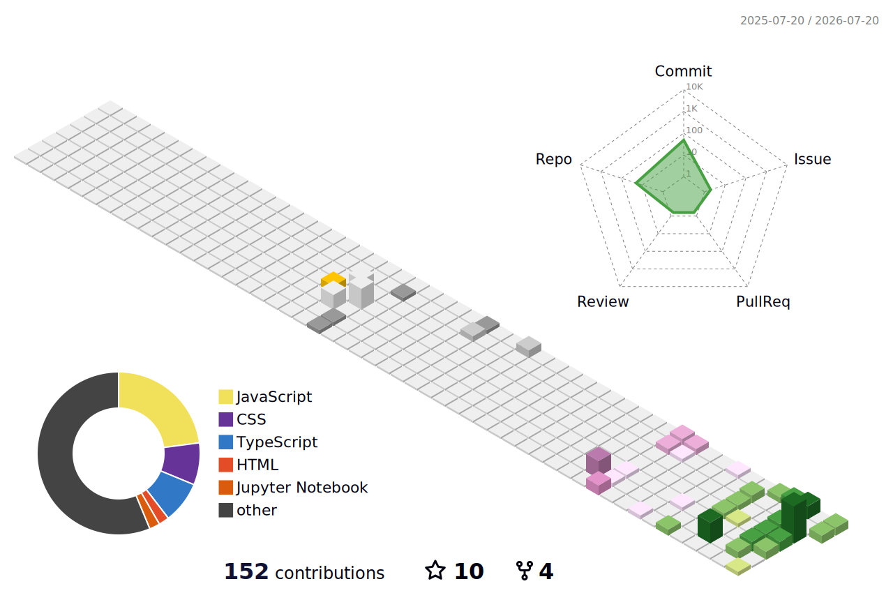

<h1>Hi, I'm Gowtham Rajendran 👋</h1>
<h3>Senior Software Engineer · Cloud · System Design</h3>

 

 

## 🖥️ whoami

  

 

## 🛠️ Tech Stack

  

 

## 💼 Experience

  

 

<b>🟡 Senior Software Engineer — Canorouse Technology</b> &nbsp;Feb 2026 – Present

 

Building AI-powered SaaS products — from LLM-driven features to scalable multi-tenant cloud architecture.

<code>Node.js</code> <code>React</code> <code>OpenAI API</code> <code>AWS</code> <code>MongoDB</code>

<b>🔵 Software Engineer — Cobay</b> &nbsp;Jan 2025 – Aug 2025

 

Built shipping & inventory systems for *Vilvah, Dudeme, Oorla*.

<code>Vue.js</code> <code>Node.js</code> <code>MongoDB</code> <code>AWS EC2/S3</code> <code>Webhooks</code>

<b>🔵 Full Stack Developer — SCH Infotech</b> &nbsp;Apr 2023 – Aug 2023

 

Angular + NestJS/Node.js apps for *Emirates Steel, L&T*.

<code>Angular</code> <code>NestJS</code> <code>MySQL</code> <code>MongoDB</code>

<b>🔵 Application Developer — IBM</b> &nbsp;Aug 2022 – Jan 2023

 

REST API integrations for *AT&T*.

<code>Angular</code> <code>Spring Boot</code>

**🎓 B.E. Instrumentation & Control Engineering** — PSG College of Technology, Coimbatore (2022)
**📜 Certified:** IBM GBS Associate (Java Full Stack) · Red Hat Certified Specialist in Containers & Kubernetes

 

## 🎨 Featured Projects

| | | |
|---|---|---|
| 🔺 **[laser-flow](https://github.com/Gowtham-R03/laser-flow)** | Full-screen animated WebGL laser beam effect | `three.js` `React` |
| 🌀 **[image-trail](https://github.com/Gowtham-R03/image-trail)** | Interactive image trail cursor effect | `React` `TypeScript` `GSAP` |
| 🖐️ **[AirDrawer](https://github.com/Gowtham-R03/AirDrawer)** | Draw in the air using AI-powered hand tracking | `MediaPipe` `React` `Canvas` |
| ✋ **[Hand-Tracking](https://github.com/Gowtham-R03/Hand-Tracking)** | Real-time webcam hand tracking with glitch visuals | `MediaPipe` `OpenCV` |
| 🪩 **[Holographic-Tilt-Login](https://github.com/Gowtham-R03/Holographic-Tilt-Login)** | Holographic tilt-effect login card | `CSS` |
| 🚗 **[CarCounter](https://github.com/Gowtham-R03/CarCounter)** | Drone-view vehicle counting & tracking | `OpenCV` `Python` |

<b>📦 More projects</b>

 

| Project | Description |
|---|---|
| [Human-Pose-Detector](https://github.com/Gowtham-R03/Human-Pose-Detector) | 33-landmark human pose detection with MediaPipe |
| [CNN-TrafficSign-Detection](https://github.com/Gowtham-R03/CNN-TrafficSign-Detection) | CNN model for traffic sign detection |
| [CNN_DigitDetection](https://github.com/Gowtham-R03/CNN_DigitDetection) | Digit classification & detection using CNN |
| [Customer_Churn_Prediction](https://github.com/Gowtham-R03/Customer_Churn_Prediction) | ANN model to predict customer churn |
| [Attendance-Monitoring](https://github.com/Gowtham-R03/Attendance-Monitoring) | Attendance storage to AWS S3 + local disk |
| [Object_Detection_Mobile_APP](https://github.com/Gowtham-R03/Object_Detection_Mobile_APP) | Mobile app for image class detection |
| [3D-Circular-Card](https://github.com/Gowtham-R03/3D-Circular-Card) | CSS 3D circular card interaction |
| [water-effect](https://github.com/Gowtham-R03/water-effect) | Interactive water ripple visual effect |
| [XRayVision](https://github.com/Gowtham-R03/XRayVision) | X-ray style hover reveal effect |
| [Aruco-Markers-Detection](https://github.com/Gowtham-R03/Aruco-Markers-Detection) | ArUco marker detection with OpenCV |

 

## 📊 GitHub Analytics

  

 

## 🧊 3D Contribution Graph

 

## 🐍 Contribution Snake

<picture>
  <source media="(prefers-color-scheme: dark)" srcset="https://raw.githubusercontent.com/Gowtham-R03/Gowtham-R03/output/github-contribution-grid-snake-dark.svg">
  <source media="(prefers-color-scheme: light)" srcset="https://raw.githubusercontent.com/Gowtham-R03/Gowtham-R03/output/github-contribution-grid-snake.svg">
  
</picture>

<!--
Optional add-ons — uncomment once you have the account/token:

WakaTime weekly breakdown:

Spotify now playing (via spotify-github-profile by kittinan):

Holopin badges:

-->

 

📫 **Reach me:** [gowthamrr03@gmail.com](mailto:gowthamrr03@gmail.com) · [LinkedIn](https://linkedin.com/in/gowtham-r-kod)

 

