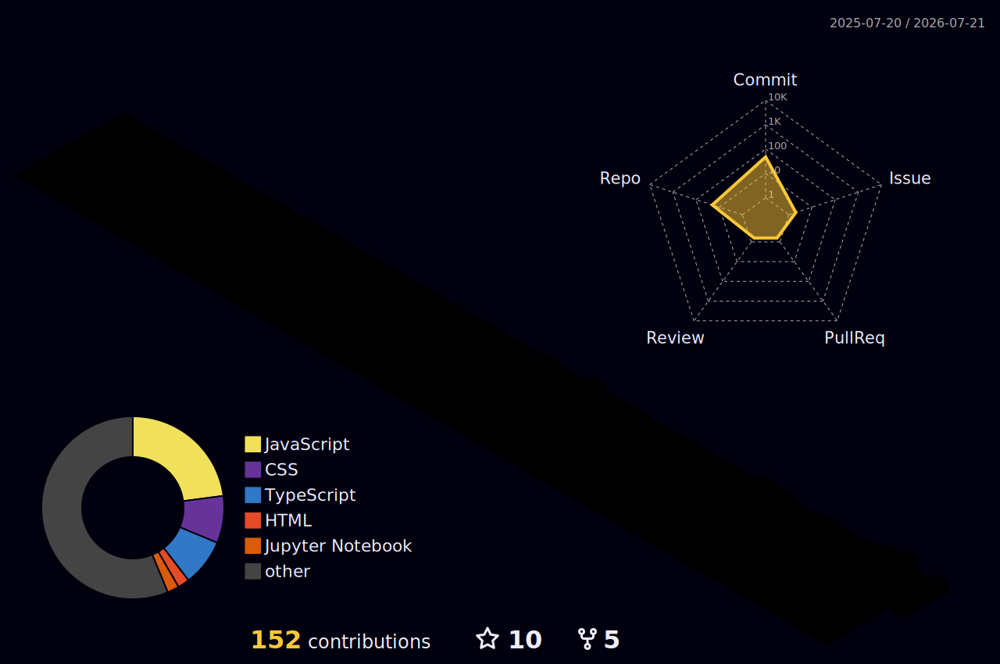

<div align="center">


<h1>Hi, I'm Gowtham Rajendran 👋</h1>
<h3>Full Stack Developer · Cloud · System Design</h3>

<a href="https://linkedin.com/in/gowtham-r-kod">
  
</a>
<a href="mailto:gowthamrr03@gmail.com">
  
</a>


<br/>

<a href="https://git.io/typing-svg">
  
</a>

</div>

<br>

## 🖥️ whoami

```bash
gowtham@dev:~$ cat about_me.txt
```

```yaml
name: Gowtham Rajendran
role: Full Stack Developer
based_in: India
focus: [System Design, Microservices, Cloud-Native Development]
stack: [Angular, React, Vue.js, Spring Boot, Node.js, MySQL, MongoDB, AWS]
side_projects: computer vision, WebGL & creative-coding experiments
currently_building: shipping & inventory platforms on AWS
open_to: backend-heavy full-stack roles, cloud & system-design work
```

<br>

## 🛠️ Tech Stack

<div align="center">

**Frontend**
<br>


<br><br>

**Backend**
<br>


<br><br>

**Database**
<br>


<br><br>

**AI / Computer Vision** <sub>· from side projects</sub>
<br>


<br><br>

**Cloud & DevOps**
<br>


</div>

<br>

## 💼 Experience

<table>
<tr>
<td width="140" valign="top"><b>2025</b><br><sub>Jan – Aug</sub></td>
<td>
<b>Software Engineer</b> — Cobay<br>
Built shipping & inventory systems for <i>Vilvah, Dudeme, Oorla</i><br>
<code>Vue.js</code> <code>Node.js</code> <code>MongoDB</code> <code>AWS EC2/S3</code> <code>Webhooks</code>
</td>
</tr>
<tr>
<td width="140" valign="top"><b>2023</b><br><sub>Apr – Aug</sub></td>
<td>
<b>Full Stack Developer</b> — SCH Infotech<br>
Angular + NestJS/Node.js apps for <i>Emirates Steel, L&T</i><br>
<code>Angular</code> <code>NestJS</code> <code>MySQL</code> <code>MongoDB</code>
</td>
</tr>
<tr>
<td width="140" valign="top"><b>2022</b><br><sub>Aug – Jan '23</sub></td>
<td>
<b>Application Developer</b> — IBM<br>
REST API integrations for <i>AT&T</i><br>
<code>Angular</code> <code>Spring Boot</code>
</td>
</tr>
</table>

**🎓 B.E. Instrumentation & Control Engineering** — PSG College of Technology, Coimbatore (2022)
**📜 Certified:** IBM GBS Associate (Java Full Stack) · Red Hat Certified Specialist in Containers & Kubernetes

<br>

## 🎨 Featured Projects

| | | |
|---|---|---|
| 🔺 **[laser-flow](https://github.com/Gowtham-R03/laser-flow)** | Full-screen animated WebGL laser beam effect | `three.js` `React` |
| 🌀 **[image-trail](https://github.com/Gowtham-R03/image-trail)** | Interactive image trail cursor effect | `React` `TypeScript` `GSAP` |
| 🖐️ **[AirDrawer](https://github.com/Gowtham-R03/AirDrawer)** | Draw in the air using AI-powered hand tracking | `MediaPipe` `React` `Canvas` |
| ✋ **[Hand-Tracking](https://github.com/Gowtham-R03/Hand-Tracking)** | Real-time webcam hand tracking with glitch visuals | `MediaPipe` `OpenCV` |
| 🪩 **[Holographic-Tilt-Login](https://github.com/Gowtham-R03/Holographic-Tilt-Login)** | Holographic tilt-effect login card | `CSS` |
| 🚗 **[CarCounter](https://github.com/Gowtham-R03/CarCounter)** | Drone-view vehicle counting & tracking | `OpenCV` `Python` |

<details>
<summary><b>📦 More projects</b></summary>
<br>

| Project | Description |
|---|---|
| [Human-Pose-Detector](https://github.com/Gowtham-R03/Human-Pose-Detector) | 33-landmark human pose detection with MediaPipe |
| [CNN-TrafficSign-Detection](https://github.com/Gowtham-R03/CNN-TrafficSign-Detection) | CNN model for traffic sign detection |
| [CNN_DigitDetection](https://github.com/Gowtham-R03/CNN_DigitDetection) | Digit classification & detection using CNN |
| [Customer_Churn_Prediction](https://github.com/Gowtham-R03/Customer_Churn_Prediction) | ANN model to predict customer churn |
| [Attendance-Monitoring](https://github.com/Gowtham-R03/Attendance-Monitoring) | Attendance storage to AWS S3 + local disk |
| [Object_Detection_Mobile_APP](https://github.com/Gowtham-R03/Object_Detection_Mobile_APP) | Mobile app for image class detection |
| [3D-Circular-Card](https://github.com/Gowtham-R03/3D-Circular-Card) | CSS 3D circular card interaction |
| [water-effect](https://github.com/Gowtham-R03/water-effect) | Interactive water ripple visual effect |
| [XRayVision](https://github.com/Gowtham-R03/XRayVision) | X-ray style hover reveal effect |
| [Aruco-Markers-Detection](https://github.com/Gowtham-R03/Aruco-Markers-Detection) | ArUco marker detection with OpenCV |

</details>

<br>

## 📊 GitHub Analytics

<!--
github-readme-stats.vercel.app (stats card + top-langs below) is
currently returning HTTP 503 "DEPLOYMENT_PAUSED" — its free-tier
Vercel deployment hit a usage cap. This is a known recurring issue
with that public instance and it typically comes back on its own.
Uncomment the two lines below once https://github-readme-stats.vercel.app
loads normally again.


-->

<div align="center">


<br>


</div>

<br>

## 🧊 3D Contribution Graph

<div align="center">



</div>

<br>

## 🐍 Contribution Snake

<div align="center">

<picture>
  <source media="(prefers-color-scheme: dark)" srcset="https://raw.githubusercontent.com/Gowtham-R03/Gowtham-R03/output/github-contribution-grid-snake-dark.svg">
  <source media="(prefers-color-scheme: light)" srcset="https://raw.githubusercontent.com/Gowtham-R03/Gowtham-R03/output/github-contribution-grid-snake.svg">
  
</picture>

</div>

<!--
Optional add-ons — uncomment once you have the account/token:

WakaTime weekly breakdown:
[](https://wakatime.com/@YOUR_WAKATIME_ID)

Spotify now playing (via spotify-github-profile by kittinan):
[](https://spotify-github-profile.vercel.app)

Holopin badges:

-->

<br>

<div align="center">

📫 **Reach me:** [gowthamrr03@gmail.com](mailto:gowthamrr03@gmail.com) · [LinkedIn](https://linkedin.com/in/gowtham-r-kod)

<br>


</div>
